# OKX API Key 创建教程

这份教程用于帮助用户创建 **只读权限** 的 OKX API Key，供本项目抓取历史交易数据使用。

## 先说清楚

这个项目只需要读取历史交易数据，不需要交易权限，也不需要提币权限。

创建 API Key 时，请遵守下面的原则：

- 只开启“读取”权限
- 不要开启“交易”权限
- 不要开启“提币”权限

如果权限开得过大，会增加安全风险，而且这个项目也用不上。

## 创建完成后，用户需要保留的内容

请用户记录好以下 3 项：

- API Key
- Secret Key
- Passphrase

注意：

- 不建议把这些内容直接发给 agent
- 更推荐由用户自己将它们写入本项目要求的配置文件
- 配置文件路径见下方教程

配置文件路径：

- Windows: `C:\Users\<你的用户名>\.okx\config.toml`
- macOS: `~/.okx/config.toml`

## 网页版创建流程

### 第 1 步：进入 API 管理页面

登录 OKX 网页版后，点击右上角头像菜单，进入 `API 与连接`。

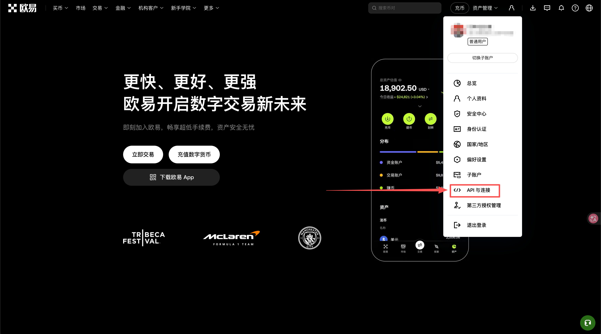

### 第 2 步：开始创建新的 API Key

进入 API 管理页面后，选择创建新的 API Key。

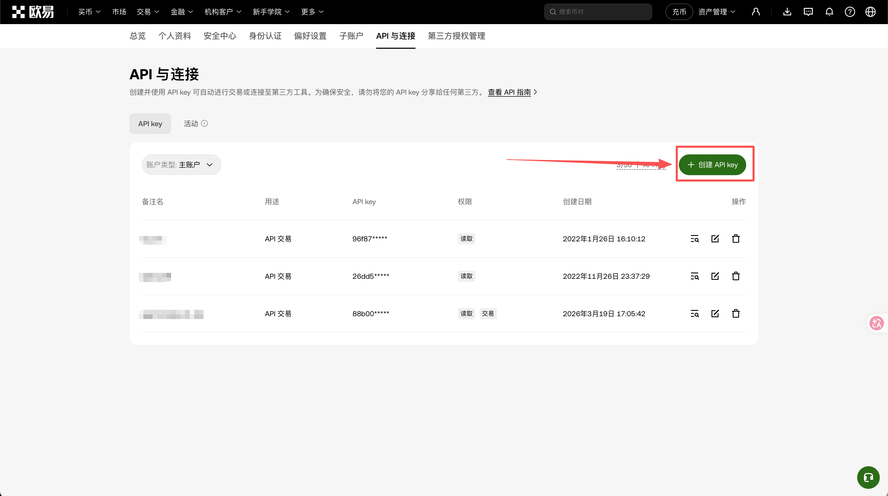

### 第 3 步：填写名称，并把权限设置为只读

创建时请注意：

- 可以填写一个容易识别的名称
- 权限请选择“读取”
- 不要开启“交易”
- 不要开启“提币”

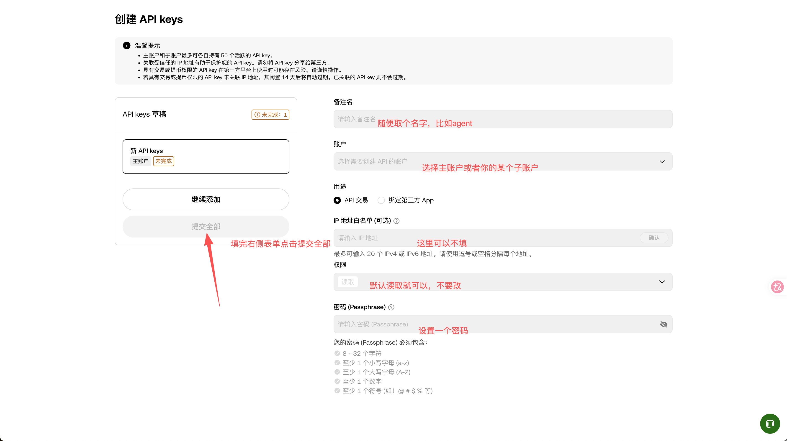

### 第 4 步：创建完成后，保存 API 信息

创建成功后，页面会显示：

- API Key
- Secret Key
- Passphrase

这一步非常重要，请先复制并保存好，再关闭窗口。

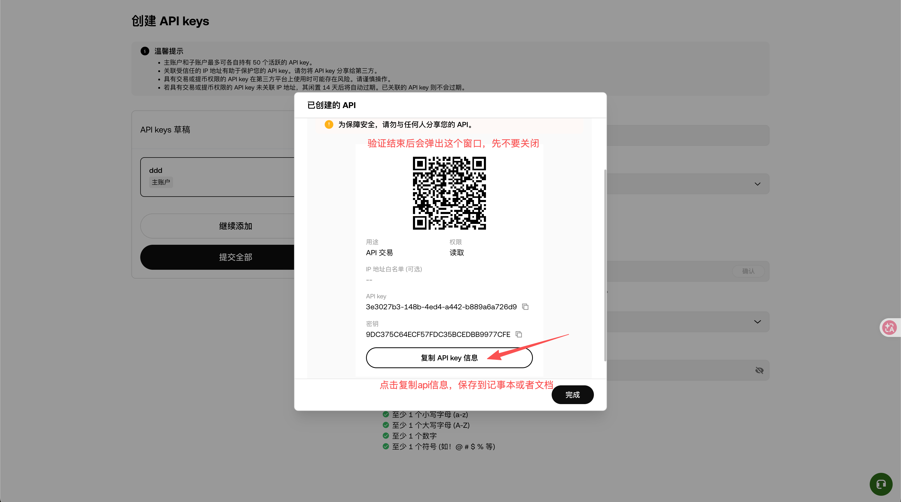

## 手机 App 创建流程

### 第 1 步：打开 App 首页菜单

进入 OKX App 首页后，先点击左上角菜单按钮。

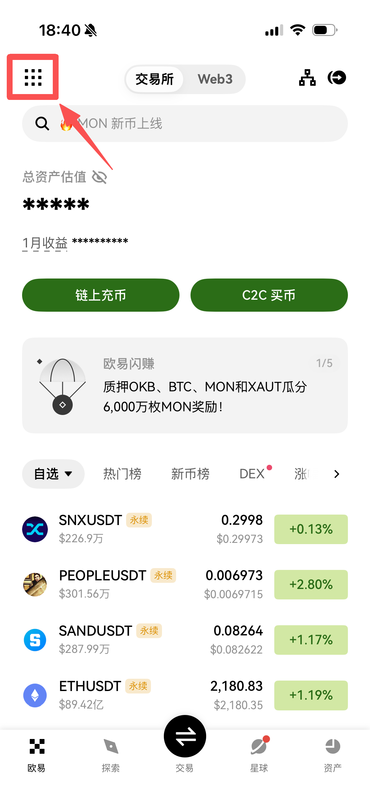

### 第 2 步：进入个人资料页面

打开侧边菜单后，点击头像区域，进入个人资料页。

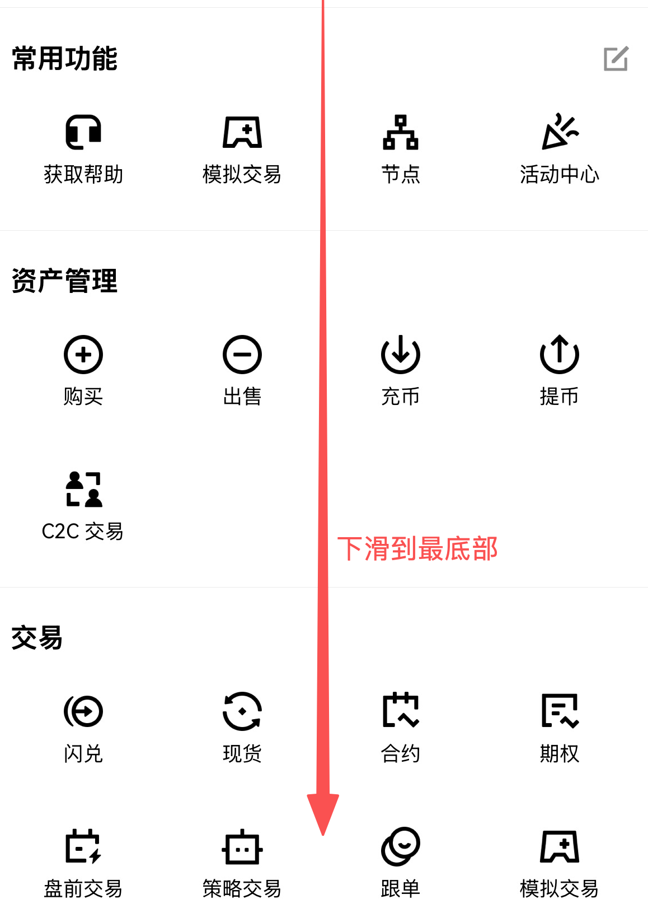

### 第 3 步：找到 API 管理入口

在个人资料页中，进入 `API` 管理页面。

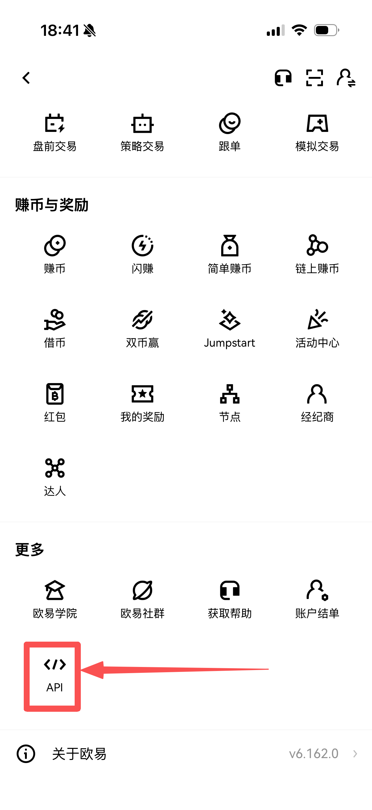

### 第 4 步：开始创建 API Key

进入 API 页面后，点击创建新的 API Key。

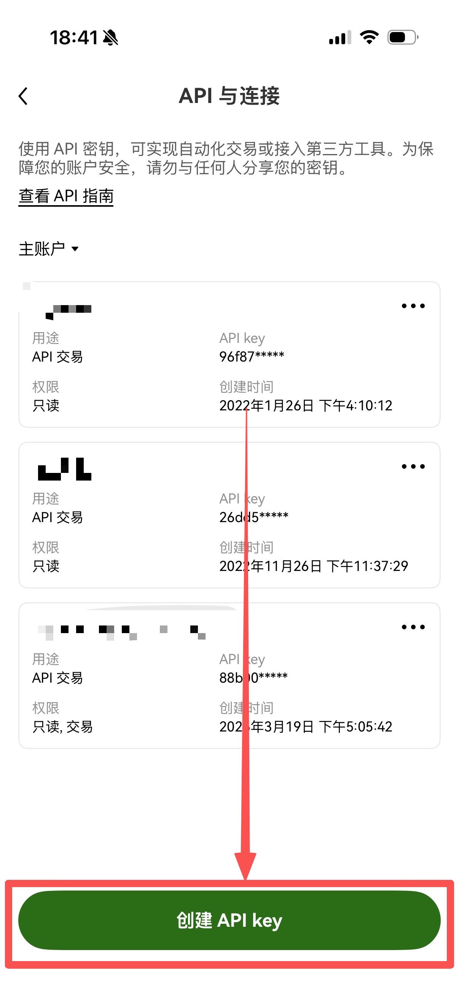

### 第 5 步：设置用途和权限

用途可以按页面要求填写，但权限一定要注意：

- 只开启“读取”
- 不要开启“交易”
- 不要开启“提币”

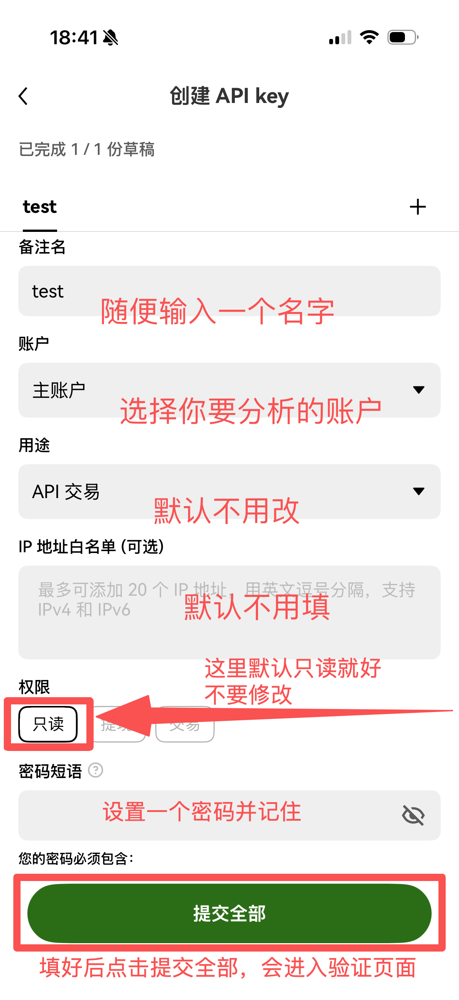

### 第 6 步：确认创建

确认信息无误后，提交创建。

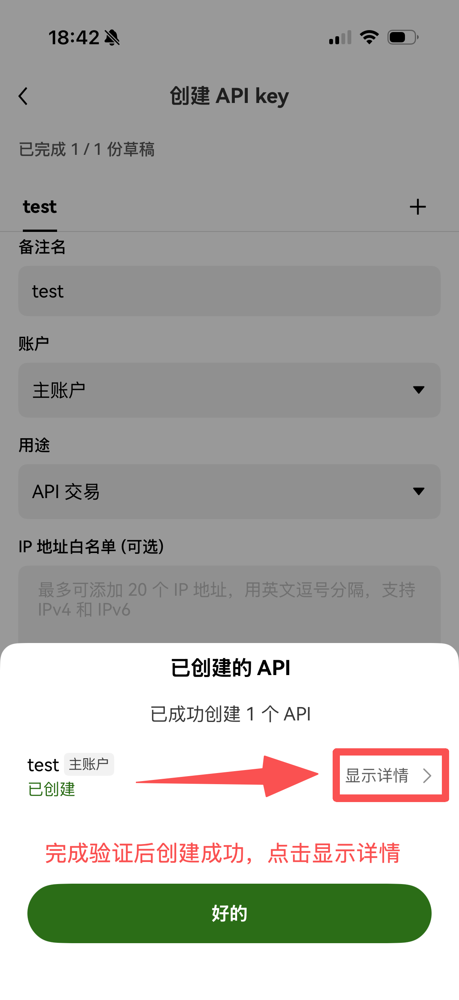

### 第 7 步：复制并保存 API 信息

创建成功后，请点击复制按钮，把以下信息妥善保存：

- API Key
- Secret Key
- Passphrase

建议下一步直接写入本地配置文件，不要发到聊天里。

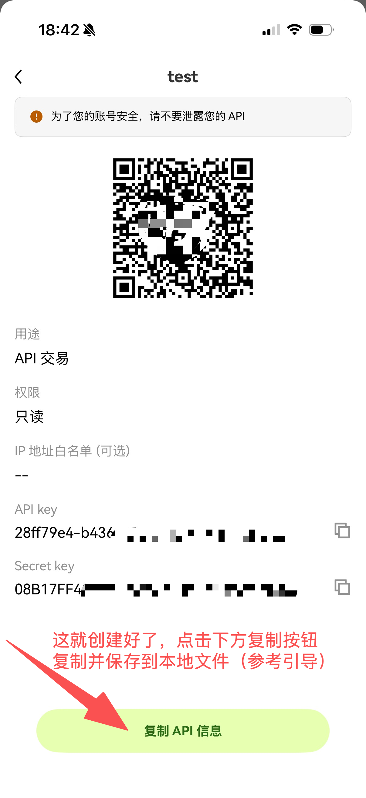

## 创建完成后下一步做什么

创建好 API Key 后，不建议直接把 key 发给 agent。

更推荐这样做：

1. 自己把 API Key / Secret Key / Passphrase 写入配置文件
2. 配置文件路径：
   - Windows: `C:\Users\<你的用户名>\.okx\config.toml`
   - macOS: `~/.okx/config.toml`
3. 写好后再告诉 agent 继续执行

配置文件填写方式请继续看：

- `docs/config-setup.md`

## 给 agent 的推荐引导文案

当用户第一次使用本 skill，且还没有配置 `~/.okx/config.toml` 时，agent 可以这样引导：

```text
在开始分析前，我先帮你完成 OKX API 配置。

这个项目只会读取你的历史交易数据，不会帮你下单，也不能提币。为了安全起见，请创建一个只开启“读取”权限的 OKX API Key，不要开启“交易”或“提币”。

创建完成后，不用把 key 直接发给我。你只需要把它保存到 `~/.okx/config.toml`，我再继续帮你抓取数据、生成报告和信件网页。
```
